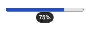
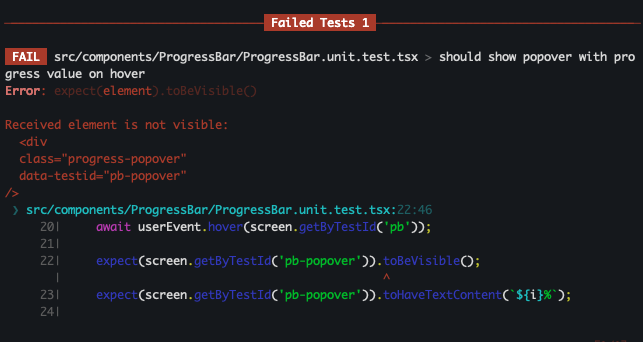
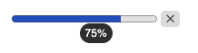
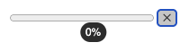
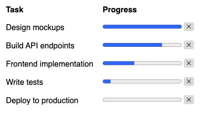
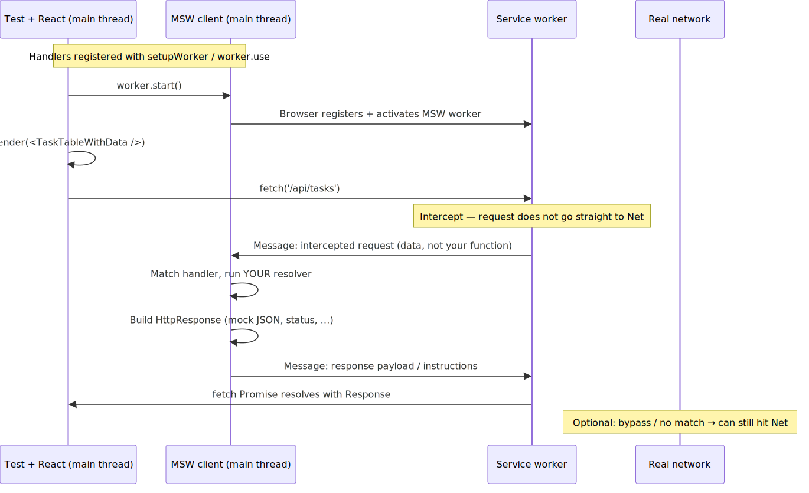

<style>
section {
  font-size: 22px;
}
table {
  font-size: 18px;
}
blockquote {
  font-size: 22px;
}
pre {
  font-size: 16px;
}
header {
  font-size: 14px;
  color: #999;
}
header strong {
  color: #2563eb;
}
section.title-slide {
  background: linear-gradient(135deg, #0f172a 0%, #1e293b 50%, #0f172a 100%);
}
section.title-slide.hiring-slide {
  position: relative;
  display: flex;
  flex-direction: column;
  justify-content: center;
  align-items: center;
  text-align: center;
  box-sizing: border-box;
  padding-bottom: clamp(72px, 14vh, 120px) !important;
}
section.title-slide.hiring-slide .hiring-slide-body {
  display: flex;
  flex-direction: column;
  align-items: center;
  justify-content: center;
  flex: 1 1 auto;
  width: 100%;
  max-width: 960px;
  margin: 0 auto;
}
section.title-slide.hiring-slide .hiring-slide-main {
  display: flex;
  flex-direction: column;
  align-items: center;
  text-align: center;
}
section.title-slide.hiring-slide .hiring-slide-main .hiring-qr-wrap img {
  display: block;
  width: min(52vw, 520px);
  height: auto;
  border-radius: 16px;
  background: #ffffff;
  padding: clamp(14px, 2vw, 22px);
  box-sizing: border-box;
}
section.title-slide.hiring-slide .hiring-slide-corner {
  position: absolute;
  left: clamp(14px, 3vw, 42px);
  bottom: clamp(10px, 2.5vh, 32px);
  display: flex;
  flex-direction: column;
  align-items: flex-start;
  text-align: left;
  z-index: 2;
  max-width: min(42vw, 220px);
}
section.title-slide.hiring-slide .hiring-slide-corner .hiring-qr-wrap img {
  display: block;
  width: min(20vw, 168px);
  height: auto;
  border-radius: 10px;
  background: #ffffff;
  padding: 8px;
  box-sizing: border-box;
}
section.title-slide.hiring-slide .hiring-thanks {
  margin-top: 0.85em;
  font-size: 1.4em;
  font-weight: 600;
  color: rgba(255, 255, 255, 0.88);
  letter-spacing: 0.03em;
}
section.part-rtl,
section.part-testkits,
section.part-msw,
section.part-ai,
section.part-methodology,
section.title-slide {
  --h1-color: #fff;
  --heading-strong-color: #fff;
  --fgColor-default: rgba(255, 255, 255, 0.95);
  --fgColor-muted: rgba(255, 255, 255, 0.7);
  color: white;
}
section.part-rtl {
  background: linear-gradient(135deg, #1e3a5f 0%, #2d5a8e 100%);
}
section.part-testkits {
  background: linear-gradient(135deg, #064e3b 0%, #047857 100%);
}
section.part-msw {
  background: linear-gradient(135deg, #7a4a1a 0%, #a66b2e 100%);
}
section.part-ai {
  background: linear-gradient(135deg, #3d1e5c 0%, #5a2d8e 100%);
}
section.part-methodology {
  background: linear-gradient(135deg, #0f172a 0%, #1e293b 100%);
}
section.split pre {
  font-size: 14px;
}
section.split .columns {
  display: grid;
  grid-template-columns: 1fr 1fr;
  gap: 16px;
}
section.split .columns.col-right-wide {
  grid-template-columns: 2fr 3fr;
}
section.split .columns.col-left-wide {
  grid-template-columns: 3fr 2fr;
}
section.flow-user-event .flow-diagram {
  display: grid;
  grid-template-columns: 1fr 1fr;
  gap: 36px;
  margin: 8px 0 20px 0;
  align-items: start;
}
section.flow-user-event .flow-column {
  display: flex;
  flex-direction: column;
  align-items: stretch;
  gap: 4px;
}
section.flow-user-event .flow-column-header {
  margin-bottom: 8px;
}
section.flow-user-event .flow-label {
  font-size: 17px;
  font-weight: 700;
  text-align: center;
  margin-bottom: 0;
  color: #0f172a;
}
/* Vitest Browser column — green (Vitest-adjacent) */
section.flow-user-event .flow-column:not(.rtl-side) .flow-label {
  color: #065f46;
}
section.flow-user-event .flow-column:not(.rtl-side) .flow-box {
  border-color: #10b981;
  color: #064e3b;
}
section.flow-user-event .flow-column:not(.rtl-side) .flow-box:hover {
  box-shadow: 0 0 0 1px #10b981;
}
section.flow-user-event .flow-box {
  display: flex;
  align-items: center;
  gap: 12px;
  border-radius: 10px;
  padding: 10px 14px;
  text-align: left;
  font-size: 17px;
  font-weight: 600;
  border: 2px solid #2563eb;
  background: transparent;
  color: #1e3a8a;
  transition: box-shadow 0.15s ease;
  box-sizing: border-box;
}
section.flow-user-event a.flow-box {
  text-decoration: none;
  cursor: pointer;
  color: inherit;
}
section.flow-user-event a.flow-box:visited {
  color: inherit;
}
section.flow-user-event a.flow-box:focus-visible {
  outline: 2px solid currentColor;
  outline-offset: 2px;
}
section.flow-user-event .flow-box:hover {
  box-shadow: 0 0 0 1px #2563eb;
}
section.flow-user-event .flow-box-logo {
  width: 36px;
  height: 36px;
  flex-shrink: 0;
  object-fit: contain;
}
section.flow-user-event .flow-box-text {
  flex: 1;
  min-width: 0;
  line-height: 1.25;
}
/* RTL column — Testing Library red */
section.flow-user-event .flow-column.rtl-side .flow-label {
  color: #991b1b;
}
section.flow-user-event .flow-column.rtl-side .flow-box {
  border-color: #ef4444;
  background: transparent;
  color: #7f1d1d;
}
section.flow-user-event .flow-column.rtl-side .flow-box:hover {
  box-shadow: 0 0 0 1px #ef4444;
}
section.flow-user-event .flow-box.flow-box-import {
  font-size: 13px;
  font-weight: 500;
  line-height: 1.35;
  font-family: ui-monospace, SFMono-Regular, Menlo, Consolas, monospace;
  padding: 10px 12px;
}
section.flow-user-event .flow-box.flow-box-import code {
  flex: 1;
  min-width: 0;
  word-break: break-word;
  background: transparent;
  padding: 0;
  font-size: inherit;
  font-weight: 500;
  color: inherit;
}
section.flow-user-event .flow-arrow {
  text-align: center;
  font-size: 22px;
  color: #94a3b8;
  line-height: 1.1;
  padding: 2px 0;
}
section.flow-user-event .flow-column:not(.rtl-side) .flow-arrow {
  color: #34d399;
}
section.flow-user-event .flow-column.rtl-side .flow-arrow {
  color: #f87171;
}
section.msw-want-diagram {
  display: flex;
  flex-direction: column;
  align-items: stretch;
  justify-content: flex-start;
  box-sizing: border-box;
}
section.msw-want-diagram h1 {
  margin-bottom: 24px;
  flex-shrink: 0;
}
section.msw-want-diagram .want-wrap {
  display: flex;
  justify-content: center;
  align-self: center;
  margin: 0;
  max-width: min(780px, 86%);
  width: 100%;
  flex-shrink: 0;
}
section.msw-want-diagram .want-browser {
  width: 100%;
  position: relative;
  border: 4px solid #cbd5e1;
  border-radius: 18px;
  padding: 48px 28px 22px;
  background: #f3f4f6;
  box-sizing: border-box;
}
section.msw-want-diagram .want-browser-label {
  position: absolute;
  top: 12px;
  left: 16px;
  padding-bottom: 12px;
  font-size: 22px;
  font-weight: 700;
  color: #4b5563;
  font-style: italic;
}
section.msw-want-diagram .want-inner {
  display: flex;
  flex-direction: column;
  gap: 16px;
}
section.msw-want-diagram .want-browser-apis {
  display: grid;
  grid-template-columns: 1fr 1fr;
  gap: 14px;
  align-items: stretch;
}
section.msw-want-diagram .want-browser-api {
  border: 3px solid #16a34a;
  border-radius: 12px;
  padding: 8px 16px;
  text-align: center;
  background: #f0fdf4;
  display: flex;
  align-items: center;
  justify-content: center;
  min-height: 0;
}
section.msw-want-diagram .want-browser-api-label {
  font-size: 19px;
  font-weight: 700;
  color: #15803d;
  line-height: 1.2;
}
section.msw-want-diagram .want-comp-area {
  display: flex;
  flex-direction: row;
  align-items: stretch;
  gap: 0;
}
section.msw-want-diagram .want-props {
  display: flex;
  flex-direction: column;
  gap: 10px;
  justify-content: center;
  margin-right: -14px;
  z-index: 2;
  position: relative;
  flex-shrink: 0;
}
section.msw-want-diagram .want-prop {
  border: 3px solid #16a34a;
  border-radius: 8px;
  padding: 8px 14px;
  background: #f0fdf4;
  color: #15803d;
  font-size: 16px;
  font-weight: 600;
  white-space: nowrap;
}
section.msw-want-diagram .want-component {
  flex: 1;
  min-width: 0;
  border: 3px solid #dc2626;
  border-radius: 14px;
  padding: 22px 20px 20px;
  text-align: center;
  background: #fef2f2;
  color: #991b1b;
  box-sizing: border-box;
  display: flex;
  flex-direction: column;
  justify-content: center;
}
section.msw-want-diagram .want-component-name {
  font-size: 26px;
  font-weight: 700;
  margin-bottom: 6px;
  color: #b91c1c;
}
section.msw-want-diagram .want-box-sub {
  font-size: 17px;
  font-weight: 500;
  color: #9f1239;
  line-height: 1.35;
}
/* Slide: The solution — Mock Service Worker (MSW) (MSW link card only) */
section.msw-solution-slide .msw-sol-diagram-only {
  display: flex;
  justify-content: center;
  margin-top: 24px;
}
section.msw-solution-slide .msw-sol-diagram-only a.msw-diag-msw-link {
  width: 240px;
  max-width: min(240px, 85vw);
  flex-shrink: 0;
}
section.msw-solution-slide .msw-diag-box {
  width: 100%;
  min-height: 168px;
  border-radius: 12px;
  padding: 18px 16px;
  text-align: center;
  font-size: 19px;
  font-weight: 700;
  line-height: 1.25;
  box-sizing: border-box;
  display: flex;
  align-items: center;
  justify-content: center;
}
section.msw-solution-slide .msw-diag-box.msw-diag-msw,
section.msw-solution-slide a.msw-diag-msw-link {
  border: 2px solid #fb923c;
  background: #ffffff;
  color: #9a3412;
}
section.msw-solution-slide a.msw-diag-msw-link {
  text-decoration: none;
  cursor: pointer;
  transition: box-shadow 0.15s ease;
}
section.msw-solution-slide a.msw-diag-msw-link:hover {
  box-shadow: 0 0 0 1px #fb923c;
}
section.msw-solution-slide a.msw-diag-msw-link:focus-visible {
  outline: 2px solid #2563eb;
  outline-offset: 3px;
}
section.msw-solution-slide .msw-diag-msw-inner {
  display: flex;
  flex-direction: column;
  align-items: center;
  gap: 10px;
}
section.msw-solution-slide .msw-diag-inline-logo {
  height: 52px;
  width: 52px;
  display: block;
  flex-shrink: 0;
}
section.msw-solution-slide .msw-diag-msw-title {
  font-size: 22px;
  font-weight: 800;
  letter-spacing: -0.02em;
}
/* Slide: How MSW runs — exported Mermaid sequence SVG */
section.msw-runtime-slide .msw-runtime-svg-wrap {
  margin: 6px auto 0;
  display: flex;
  justify-content: center;
  align-items: center;
  width: 100%;
  flex: 1 1 auto;
  min-height: 280px;
  max-height: min(520px, 72vh);
  box-sizing: border-box;
}
section.msw-runtime-slide .msw-runtime-svg-wrap img {
  display: block;
  width: 100%;
  max-width: min(100%, 980px);
  height: auto;
  max-height: min(500px, 68vh);
  object-fit: contain;
}
/* Slide: methodology workflow — default (light) theme like other content slides */
section.methodology-steps .methodology-steps-flow {
  margin: 10px auto 0;
  max-width: 900px;
  display: flex;
  flex-direction: column;
  gap: 0;
}
section.methodology-steps .methodology-step {
  display: grid;
  grid-template-columns: 48px 1fr;
  gap: 16px;
  align-items: center;
  padding: 12px 18px;
  background: #f8fafc;
  border: 1px solid #e2e8f0;
  border-radius: 14px;
  box-sizing: border-box;
}
section.methodology-steps .methodology-step-num {
  width: 42px;
  height: 42px;
  border-radius: 50%;
  background: linear-gradient(145deg, #3b82f6 0%, #2563eb 100%);
  color: #fff;
  font-size: 19px;
  font-weight: 800;
  display: flex;
  align-items: center;
  justify-content: center;
  line-height: 1;
  flex-shrink: 0;
}
section.methodology-steps .methodology-step-body strong {
  display: block;
  font-size: 20px;
  font-weight: 700;
  margin: 0;
  letter-spacing: -0.02em;
  color: #0f172a;
}
section.methodology-steps .methodology-step-arrow {
  text-align: center;
  color: #94a3b8;
  font-size: 20px;
  padding: 6px 0 8px;
  margin-left: 21px;
  line-height: 1;
}
/* Part 5: code listing slides (default/light theme like other content slides) */
section.ai-test-code-slide h1 {
  font-size: 1.2em;
  margin: 0 0 0.3em 0;
}
section.ai-test-code-slide pre {
  font-size: 9px;
  line-height: 1.14;
  margin: 0;
  padding: 10px 12px;
}
/* Two-column code on AI example slide (1/2) */
section.split.ai-test-code-slide pre {
  font-size: 6px;
  line-height: 1.08;
  padding: 5px 6px;
}
section.split.ai-test-code-slide h1 {
  margin-bottom: 0.2em;
}
/* —— Connecteam cover (slide 1): static hero + hiring QR —— */
section.cover-connecteam {
  position: relative;
  display: flex !important;
  flex-direction: column;
  justify-content: center !important;
  align-items: center !important;
  box-sizing: border-box !important;
  width: 100% !important;
  height: 100% !important;
  min-height: 720px !important;
  margin: 0 !important;
  padding: 0 !important;
  overflow: hidden;
  background-color: #030308;
  background-image: radial-gradient(140% 120% at 50% -10%, #1a1a35 0%, #06060f 45%, #030308 100%);
  background-repeat: no-repeat;
  background-size: 100% 100%;
  color: #f8fafc !important;
}
section.cover-connecteam h1,
section.cover-connecteam h2,
section.cover-connecteam p {
  color: inherit;
}
section.cover-connecteam .ct-wrap {
  position: relative;
  z-index: 1;
  width: 100%;
  max-width: 1000px;
  margin: 0 auto;
  padding: 28px 40px 36px;
  text-align: center;
  box-sizing: border-box;
}
section.cover-connecteam .ct-bg {
  position: absolute;
  top: 0;
  left: 0;
  width: 100%;
  height: 100%;
  z-index: 0;
  pointer-events: none;
  overflow: hidden;
}
section.cover-connecteam .ct-orb {
  position: absolute;
  border-radius: 50%;
  filter: blur(72px);
  opacity: 0.72;
}
section.cover-connecteam .ct-orb-1 {
  width: min(70vw, 900px);
  height: min(70vw, 900px);
  background: #4f46e5;
  top: -35%;
  left: -25%;
}
section.cover-connecteam .ct-orb-2 {
  width: min(65vw, 820px);
  height: min(65vw, 820px);
  background: #14b8a6;
  bottom: -40%;
  right: -28%;
}
section.cover-connecteam .ct-orb-3 {
  width: min(45vw, 560px);
  height: min(45vw, 560px);
  background: #8b5cf6;
  top: 30%;
  left: 35%;
}
section.cover-connecteam .ct-grid {
  position: absolute;
  inset: 0;
  opacity: 0.72;
  background-image: linear-gradient(rgba(255, 255, 255, 0.14) 1px, transparent 1px),
    linear-gradient(90deg, rgba(255, 255, 255, 0.14) 1px, transparent 1px);
  background-size: 40px 40px;
}
section.cover-connecteam .ct-inner {
  position: relative;
  z-index: 2;
}
section.cover-connecteam .ct-visual {
  position: relative;
  width: min(92vw, 760px);
  margin: 0 auto 18px;
}
section.cover-connecteam .ct-ring {
  display: none;
}
section.cover-connecteam .ct-card {
  position: relative;
  width: 100%;
  border-radius: 18px;
  background: transparent;
  border: none;
  box-shadow: none;
  display: flex;
  align-items: center;
  justify-content: center;
  padding: 8px 0 4px;
}
/* Dark SVG mark → light on transparent plate so it reads on the cover gradient */
section.cover-connecteam .ct-logo-official {
  display: block;
  width: 100%;
  max-width: min(640px, 86vw);
  height: auto;
  filter: brightness(0) invert(1);
  opacity: 0.94;
}
section.cover-connecteam .ct-sub {
  font-size: clamp(1.05rem, 2.2vw, 1.35rem);
  font-weight: 500;
  color: rgba(248, 250, 252, 0.82);
  margin: 0;
  letter-spacing: 0.01em;
}
</style>

<!-- _paginate: false -->
<!-- _header: "" -->
<!-- _class: cover-connecteam -->

<div class="ct-bg" aria-hidden="true">
  <div class="ct-orb ct-orb-1"></div>
  <div class="ct-orb ct-orb-2"></div>
  <div class="ct-orb ct-orb-3"></div>
  <div class="ct-grid"></div>
</div>
<div class="ct-wrap">
<div class="ct-inner">
  <div class="ct-visual">
    <div class="ct-ring" aria-hidden="true"></div>
    <div class="ct-card">
      
    </div>
  </div>
  <p class="ct-sub">The employee app for your deskless workforce — scheduling, time tracking, ops &amp; comms in one place.</p>
</div>
</div>

---

<!-- _class: lead title-slide -->

# A method for browser component testing
## From React Testing Library to Vitest Browser Mode

---

# What we'll answer today

1. **Why did we move away** from React Testing Library?
2. **What makes Vitest Browser Mode** better for component testing?
3. **What is a testkit** and why should every component have one?
4. **How to mock** API calls in browser tests?
5. **Can AI write our tests** if we give it the right context?

---

<!-- _header: "" -->
<!-- _class: lead part-rtl -->

# Part 1: Why we left RTL

**Three pain points that pushed us to Vitest Browser Mode**

---

<!-- _class: split -->

# What is Vitest Browser Mode?

Vitest Browser Mode runs your component tests **inside a real browser** (Chromium via Playwright) instead of a simulated DOM (JSDOM).

To render React components, we use **`vitest-browser-react`** — the equivalent of `render` from RTL, but for the real browser.

<div class="columns">

<div>

```tsx
// vitest.config.ts
import { defineConfig } from 'vitest/config';

export default defineConfig({
  test: {
    browser: {
      enabled: true,
      provider: 'playwright',
      instances: [{ browser: 'chromium' }],
    },
  },
});
```

</div>

<div>

```tsx
import { render } from 'vitest-browser-react';
import { page } from 'vitest/browser';

it('should render', async () => {
  await render(<MyComponent />);

  expect(
    page.getByText('Hello').element()
  ).toBeInTheDocument();
});
```

</div>

</div>

---

<!-- header: "**Why we left RTL** > Testkits > Mocking APIs > Summary > AI-powered testing" -->

# Meet the ProgressBar



```tsx
export const ProgressBar = ({ id, testId = 'progress-bar', initialValue = 0 }) => {
  const [progress, setProgress] = useState(initialValue);

  useEffect(() => {
    const handler = (e: Event) => {
      if (e instanceof CustomEvent) setProgress(e.detail);
    };
    window.addEventListener(`progress-${id}`, handler);
    return () => window.removeEventListener(`progress-${id}`, handler);
  }, [id]);

  return (
    <div className="progress-wrapper">
      <style>{`.progress-wrapper:hover .progress-popover { display: block; }`}</style>
      <progress value={progress} max={100} data-testid={testId} />
      <div className="progress-popover" data-testid={`${testId}-popover`}>
        {progress}%
      </div>
    </div>
  );
};
```

---

# RTL test

```tsx
import { render, screen, cleanup, act } from '@testing-library/react';
import userEvent from '@testing-library/user-event';

it('should show popover with progress value on hover', async () => {
  render(<ProgressBar id="upload" testId="pb" />);

  for (let i = 5; i <= 100; i = i + 5) {
    act(() => {
      window.dispatchEvent(new CustomEvent('progress-upload', { detail: i }));
    });

    expect(screen.getByTestId('pb-popover')).not.toBeVisible();

    await userEvent.hover(screen.getByTestId('pb'));

    expect(screen.getByTestId('pb-popover')).toBeVisible();
    expect(screen.getByTestId('pb-popover')).toHaveTextContent(`${i}%`);

    await userEvent.unhover(screen.getByTestId('pb'));
  }
});
```

---

# Hover test fails

> JSDOM doesn't have a CSS engine. It can't compute `:hover` pseudo-class styles. The popover stays `display: none` no matter what.



> `toBeVisible()` fails because JSDOM never applies the CSS `:hover` rule. The element stays hidden regardless of `userEvent.hover()`.

---

# Hover works with Vitest Browser Mode

The same test, running in a real Chromium browser:

```tsx
import { render } from 'vitest-browser-react';
import { page, userEvent } from 'vitest/browser';

it('should show popover with progress value on hover', async () => {
  await render(<ProgressBar id="upload" testId="pb" />);

  for (let i = 5; i <= 100; i = i + 5) {
    window.dispatchEvent(new CustomEvent('progress-upload', { detail: i }));

    await expect.element(page.getByTestId('pb-popover')).not.toBeVisible();

    await userEvent.hover(page.getByTestId('pb'));

    await expect.element(page.getByTestId('pb-popover')).toBeVisible();
    await expect.element(page.getByTestId('pb-popover')).toHaveTextContent(`${i}%`);

    await userEvent.unhover(page.getByTestId('pb'));
  }
});
```

> Real browser = real CSS = real hover.

---

# No UI feedback with RTL

**React Testing Library output:**

```
✓ should show popover with progress value on hover (12ms)
```

A list of green checkmarks. You don't see what happened.

**Vitest Browser Mode output:**

You see the **actual component rendered in a real browser**, with hover states, clicks, and transitions playing out in real time.

---

<!-- _header: "" -->
<!-- _class: lead part-testkits -->

# Part 2: Testkits

**One testkit per component, decoupled from implementation details**

---

<!-- header: "Why we left RTL > **Testkits** > Mocking APIs > Summary > AI-powered testing" -->

# Meet the ProgressBar with hover and reset

The component now also has a reset button:

  

```tsx
export const ProgressBar = ({ value, onReset, testId = 'progress-bar' }) => {
  return (
    <div className="progress-wrapper">
      <style>{`.progress-wrapper:hover .progress-popover { display: block; }`}</style>
      <progress value={value} max={100} data-testid={testId} />
      <div className="progress-popover" data-testid={`${testId}-popover`}>
        {value}%
      </div>
      <button
        className="progress-reset-btn"
        data-testid={`${testId}-reset`}
        onClick={onReset}
      >✕</button>
    </div>
  );
};
```

> Note the internal test IDs: `{testId}`, `{testId}-popover`, `{testId}-reset`. These are implementation details.

---

<!-- _class: split -->

# Meet the TaskTable

A `TaskTable` that renders a list of tasks, each with a `ProgressBar`:

<div class="columns">

<div>

```tsx
import { ProgressBar } from '@demo/progress-with-hover-and-reset';
import { TEST_IDS } from './TaskTable.testIds';

export const TaskTable = ({ tasks }) => {
  const [taskState, setTaskState] = useState(tasks);

  const handleReset = (taskId: string) => {
    setTaskState((prev) =>
      prev.map((t) => (t.id === taskId ? { ...t, progress: 0 } : t))
    );
  };

  return (
    <table data-testid={TEST_IDS.TASKS_TABLE}>
      {taskState.map((task) => (
        <tr key={task.id}>
          <td>{task.name}</td>
          <td>
            <ProgressBar
              value={task.progress}
              onReset={() => handleReset(task.id)}
              testId={TEST_IDS.PROGRESS_TASK_TABLE(task.id)}
            />
          </td>
        </tr>
      ))}
    </table>
  );
};
```

</div>

<div>

```tsx
// TaskTable.testIds.ts

export const TEST_IDS = {
  TASKS_TABLE: 'tasks-table',

  PROGRESS_TASK_TABLE: (taskId: string) =>
    `${TEST_IDS.TASKS_TABLE}-progress-${taskId}`,
};
```

</div>

</div>

---

# TaskTable in action



---

<!-- _class: split -->

# Let's write a test

<div class="columns">

<div>

```tsx
import { page, userEvent } from 'vitest/browser';
import { TEST_IDS } from './TaskTable.testIds';

const tasks: Task[] = [
  { id: 'design', name: 'Design mockups', progress: 80 },
  { id: 'api', name: 'Build API', progress: 30 },
];

it('should reset progress', async () => {
  await render(<TaskTable tasks={tasks} />);

  await expect.element(
    page.getByTestId(TEST_IDS.PROGRESS_TASK_TABLE('design'))
  ).toHaveValue(80);

  await userEvent.click(
    page.getByTestId(`${TEST_IDS.PROGRESS_TASK_TABLE('design')}-reset`)
  );

  await expect.element(
    page.getByTestId(TEST_IDS.PROGRESS_TASK_TABLE('design'))
  ).toHaveValue(0);
});
```

</div>

<div>

**Problems**

- **I have to know ProgressBar's internal test IDs** — `{testId}-reset`, `{testId}-popover`...

- **If a test ID changes, my tests break**

- **`.toHaveValue()` assumes it's a `<progress>`**

</div>

</div>

---

<!-- _class: split -->

# The solution: a testkit

Each component exposes a **testkit** — framework-agnostic: it takes an **`HTMLElement` scope**, uses **`querySelector`** on `[data-testid="…"]`, and a small **`user` adapter** for user interactions.

<div class="columns col-right-wide">

<div>

```tsx
export interface TestkitUserEvent {
  hover(element: HTMLElement): Promise<void>;
  unhover(element: HTMLElement): Promise<void>;
  click(element: HTMLElement): Promise<void>;
}

function queryByTestId(root: HTMLElement, testId: string): HTMLElement {
  const sel = `[data-testid="${CSS.escape(testId)}"]`;
  if (root.matches(sel)) return root;
  const el = root.querySelector(sel);
  if (!el || !(el instanceof HTMLElement)) {
    throw new Error(`No element with data-testid="${testId}"`);
  }
  return el;
}
```

</div>

<div>

```tsx
// ProgressBar.testkit.ts

export class ProgressBarTestkit {
  constructor(
    private container: HTMLElement,
    private user: TestkitUserEvent,
    private testId: string,
  ) {}

  getProgressElement()     { return queryByTestId(this.container, this.testId); }
  getPopoverElement()      { return queryByTestId(this.container, `${this.testId}-popover`); }
  getResetButtonElement()  { return queryByTestId(this.container, `${this.testId}-reset`); }

  getProgressValue(): number {
    return (this.getProgressElement() as HTMLProgressElement).value;
  }
  getProgressPopoverText(): string {
    return this.getPopoverElement().textContent?.trim() ?? '';
  }

  async hover()     { await this.user.hover(this.getProgressElement()); }
  async unhover()   { await this.user.unhover(this.getProgressElement()); }
  async clickReset(){ await this.user.click(this.getResetButtonElement()); }
}
```

</div>

</div>

---

# Why framework-agnostic?

The testkit only queries inside an **`HTMLElement`** you pass in. You choose the root (`document.body`, a table, the RTL `container` from `render`, etc.):

```tsx
// Vitest Browser Mode — scope to the whole document or a subtree
import { page, userEvent } from 'vitest/browser';
await render(<ProgressBar value={50} onReset={() => {}} testId="pb" />);
const root = document.body;
const pb = new ProgressBarTestkit(root, userEvent, 'pb');
```

```tsx
// React Testing Library — scope to what `render` returned
import { render } from '@testing-library/react';
import userEvent from '@testing-library/user-event';
const user = userEvent.setup();
const { container: root } = render(<ProgressBar value={50} onReset={() => {}} testId="pb" />);
const pb = new ProgressBarTestkit(root as HTMLElement, user, 'pb');
```

> The testkit never imports a framework. It uses `querySelector` on `data-testid` under your root.

---

# Rewriting TaskTable tests with the testkit

```tsx
import { render } from 'vitest-browser-react';
import { it, expect, describe } from 'vitest';
import { TaskTable, Task } from './TaskTable';
import { TEST_IDS } from './TaskTable.testIds';
import { userEvent } from 'vitest/browser';
import { ProgressBarTestkit } from '@demo/progress-with-hover-and-reset';

const tasks: Task[] = [
  { id: '123', name: 'Design mockups', progress: 80 },
  { id: '456', name: 'Build API', progress: 30 },
];

describe('TaskTable', () => {
  it('should show popover on hover and reset progress on reset click', async () => {
    const designProgress = new ProgressBarTestkit(document.body, userEvent, TEST_IDS.PROGRESS_TASK_TABLE('123'));
    const apiProgress = new ProgressBarTestkit(document.body, userEvent, TEST_IDS.PROGRESS_TASK_TABLE('456'));

    await render(<TaskTable tasks={tasks} />);

    expect(designProgress.getProgressElement()).toBeInTheDocument();
    expect(designProgress.getProgressValue()).toBe(80);

    await designProgress.hover();
    expect(designProgress.getPopoverElement()).toBeVisible();
    expect(designProgress.getProgressPopoverText()).toBe('80%');
    await designProgress.unhover();

    await designProgress.clickReset();
    expect(designProgress.getProgressValue()).toBe(0);
    expect(apiProgress.getProgressValue()).toBe(30);
  });
});
```

---

<!-- _class: flow-user-event -->
<!-- header: "Why we left RTL > **Testkits** > Mocking APIs > Summary > AI-powered testing" -->

# `userEvent`: Vitest Browser vs RTL

<div class="flow-diagram">
<div class="flow-column">
<div class="flow-column-header">
<div class="flow-label">Real browser stack</div>
</div>
<a class="flow-box flow-box-import" href="https://vitest.dev/api/browser/interactivity" target="_blank" rel="noopener noreferrer"><code>import { userEvent } from 'vitest/browser';</code></a>
<div class="flow-arrow">↓</div>
<a class="flow-box" href="https://playwright.dev/" target="_blank" rel="noopener noreferrer"><span class="flow-box-text">Playwright</span></a>
<div class="flow-arrow">↓</div>
<a class="flow-box" href="https://chromedevtools.github.io/devtools-protocol/" target="_blank" rel="noopener noreferrer"><span class="flow-box-text">Chrome DevTools Protocol</span></a>
<div class="flow-arrow">↓</div>
<a class="flow-box" href="https://www.chromium.org/chromium-projects/" target="_blank" rel="noopener noreferrer"><span class="flow-box-text">Real browser (Chromium)</span></a>
</div>
<div class="flow-column rtl-side">
<div class="flow-column-header">
<div class="flow-label">In-memory stack <span style="font-weight:500;color:#b91c1c">(typical RTL)</span></div>
</div>
<a class="flow-box flow-box-import" href="https://testing-library.com/docs/user-event/intro/" target="_blank" rel="noopener noreferrer"><code>import userEvent from '@testing-library/user-event';</code></a>
<div class="flow-arrow">↓</div>
<a class="flow-box" href="https://github.com/jsdom/jsdom" target="_blank" rel="noopener noreferrer"><span class="flow-box-text">JSDOM</span></a>
<div class="flow-arrow">↓</div>
<div class="flow-box"><span class="flow-box-text">Simulated JS events</span></div>
</div>
</div>

---

<!-- header: "Why we left RTL > **Testkits** > Mocking APIs > Summary > AI-powered testing" -->

# `userEvent`: what changes in practice

| | **Vitest Browser** (`vitest/browser`) | **RTL** (`@testing-library/user-event`) |
|---|---|---|
| **`hover`** | Triggers real CSS `:hover` | Fires JS events only — no CSS effect |
| **`unhover`** | Moves pointer away — CSS `:hover` is removed | Fires `mouseleave` — CSS stays unchanged |
| **`click`** | Full browser click pipeline (focus, pointer, mousedown, mouseup, click) | Simulated JS events |
| **`type`** | Real keyboard input — autocomplete, validation | Simulated `keydown`/`keypress`/`keyup` |
| **Async** | All methods are `async` | All methods are `async` |
| **Setup** | Import and use directly | Direct `userEvent.click()` / `hover()` / … works without `setup()`; **`user = userEvent.setup()` is required** in some cases (ex: `user.keyboard('{Shift}'); user.keyboard('{/Shift}')`) |

---

<!-- _header: "" -->
<!-- _class: lead part-msw -->

# Part 3: Mocking APIs

**Mock at the HTTP level, not in your code**

---

<!-- _class: split -->
<!-- header: "Why we left RTL > Testkits > **Mocking APIs** > Summary > AI-powered testing" -->

# Meet the component

**`TaskTableWithData`** fetches tasks from **`GET /api/tasks`**, then renders **`TaskTable`**.

<div class="columns col-right-wide">

<div>

```tsx
// getTasks.ts
import type { Task } from '@demo/table-tasks';

export async function getTasks(): Promise<Task[]> {
  const res = await fetch('/api/tasks');
  if (!res.ok) throw new Error(String(res.status));
  return res.json() as Promise<Task[]>;
}
```

</div>

<div>

```tsx
import { useState, useEffect } from 'react';
import { TaskTable, type Task } from '@demo/table-tasks';
import { getTasks } from './getTasks';

export const TaskTableWithData = () => {
  const [tasks, setTasks] = useState<Task[]>([]);
  const [loading, setLoading] = useState(true);
  const [error, setError] = useState<string | null>(null);

  useEffect(() => {
    setLoading(true); setError(null);
    getTasks()
      .then((data) => { setTasks(data); setLoading(false); })
      .catch(() => { setError('Failed to load tasks'); setLoading(false); });
  }, []);

  if (loading) {
    return <div data-testid="task-table-with-data-loading">Loading...</div>;
  }
  if (error) {
    return <div data-testid="task-table-with-data-error">{error}</div>;
  }
  return <TaskTable tasks={tasks} />;
};
```

</div>

</div>

---

<!-- header: "Why we left RTL > Testkits > **Mocking APIs** > Summary > AI-powered testing" -->

# What we want to avoid: mocking your own code

```tsx
// ❌ Don't do this
vi.spyOn(global, 'fetch').mockResolvedValue({
  json: () => Promise.resolve(mockTasks),
});
```

```tsx
// ❌ Don't do this either
vi.mock('axios');
(axios.get as Mock).mockResolvedValue({ data: mockTasks });
```

```tsx
// ❌ Don't do this
import * as tasksApi from './getTasks';

vi.spyOn(tasksApi, 'getTasks').mockResolvedValue(mockTasks);
```

> Every refactor that touches that path — swap client, extract `getTasks`, rename a module — forces you to rewrite the tests, even when behavior for the user stays the same.

---

<!-- _class: msw-want-diagram -->
<!-- header: "Why we left RTL > Testkits > **Mocking APIs** > Summary > AI-powered testing" -->

# What we want:

<div class="want-wrap">
<div class="want-browser">
<span class="want-browser-label">browser</span>
<div class="want-inner">
<div class="want-browser-apis">
<div class="want-browser-api">
<div class="want-browser-api-label">http</div>
</div>
<div class="want-browser-api">
<div class="want-browser-api-label">local storage</div>
</div>
</div>
<div class="want-comp-area">
<div class="want-props">
<div class="want-prop">prop 1</div>
<div class="want-prop">prop N</div>
</div>
<div class="want-component">
<div class="want-component-name">Your component</div>
<div class="want-box-sub">State, children, hooks — refactors here don’t change the HTTP contract</div>
</div>
</div>
</div>
</div>
</div>

---

<!-- _class: msw-solution-slide -->
<!-- header: "Why we left RTL > Testkits > **Mocking APIs** > Summary > AI-powered testing" -->

# The solution: Mock Service Worker (MSW)

**MSW** registers a **service worker** that **intercepts HTTP** from your component and answers with **mock responses** from the **handlers** you define.

<div class="msw-sol-diagram-only">
<a class="msw-diag-box msw-diag-msw msw-diag-msw-link" href="https://mswjs.io/docs/quick-start" target="_blank" rel="noopener noreferrer" aria-label="MSW — open Quick start documentation">
<div class="msw-diag-msw-inner">

<span class="msw-diag-msw-title">MSW</span>
</div>
</a>
</div>

---

<!-- _class: split -->
<!-- header: "Why we left RTL > Testkits > **Mocking APIs** > Summary > AI-powered testing" -->

# TaskTableWithData tests with MSW

<div class="columns col-left-wide">

<div>

```tsx
import { render } from 'vitest-browser-react';
import { it, expect, describe, beforeAll, afterAll, afterEach } from 'vitest';
import { TaskTableWithData, TASK_TABLE_LOADING_TEST_ID } from './TaskTableWithData';
import { TEST_IDS } from '@demo/table-tasks';
import { page, userEvent } from 'vitest/browser';
import { ProgressBarTestkit } from '@demo/progress-with-hover-and-reset';
import { http, HttpResponse } from 'msw';
import { setupWorker } from 'msw/browser';

const worker = setupWorker(
  http.get('/api/tasks', () => {
    return HttpResponse.json([]);
  })
);

beforeAll(async () => {
  await worker.start({ onUnhandledRequest: 'bypass' });
});

afterEach(() => {
  worker.resetHandlers();
});

afterAll(() => {
  worker.stop();
});

describe('TaskTableWithData', () => {
  it('shows loading, then progress values after the HTTP response', async () => {
    worker.use(
      http.get('/api/tasks', async () => {
        await new Promise((r) => setTimeout(r, 150));
        return HttpResponse.json([
          { id: 'design', name: 'Design mockups', progress: 80 },
          { id: 'api', name: 'Build API', progress: 30 },
        ]);
      })
    );
```

</div>

<div>

```tsx
    const designProgress = new ProgressBarTestkit(
      document.body,
      userEvent,
      TEST_IDS.PROGRESS_TASK_TABLE('design'),
    );
    const apiProgress = new ProgressBarTestkit(
      document.body,
      userEvent,
      TEST_IDS.PROGRESS_TASK_TABLE('api'),
    );

    await render(<TaskTableWithData />);

    await expect
      .element(page.getByTestId(TASK_TABLE_LOADING_TEST_ID))
      .toBeInTheDocument();

    await expect
      .element(page.getByTestId(TASK_TABLE_LOADING_TEST_ID))
      .not.toBeInTheDocument();

    expect(designProgress.getProgressElement()).toBeInTheDocument();
    expect(designProgress.getProgressValue()).toBe(80);

    expect(apiProgress.getProgressElement()).toBeInTheDocument();
    expect(apiProgress.getProgressValue()).toBe(30);
  });
});
```

</div>

</div>

---

<!-- _class: msw-runtime-slide -->
<!-- header: "Why we left RTL > Testkits > **Mocking APIs** > Summary > AI-powered testing" -->

# How MSW runs in our browser tests

<div class="msw-runtime-svg-wrap">

</div>

---

<!-- _header: "" -->
<!-- _class: lead part-methodology -->

# Part 4: Summarise the method

**Four steps to reliable browser tests**

---

<!-- _class: methodology-steps -->
<!-- header: "Why we left RTL > Testkits > Mocking APIs > **Summary** > AI-powered testing" -->

# Component Test Workflow

<div class="methodology-steps-flow">

<div class="methodology-step">
<span class="methodology-step-num">1</span>
<div class="methodology-step-body">
<strong>Detect and mock HTTP requests using MSW</strong>
</div>
</div>

<div class="methodology-step-arrow">↓</div>

<div class="methodology-step">
<span class="methodology-step-num">2</span>
<div class="methodology-step-body">
<strong>Create a testkit instance per component you’ll interact with</strong>
</div>
</div>

<div class="methodology-step-arrow">↓</div>

<div class="methodology-step">
<span class="methodology-step-num">3</span>
<div class="methodology-step-body">
<strong>Render your component</strong>
</div>
</div>

<div class="methodology-step-arrow">↓</div>

<div class="methodology-step">
<span class="methodology-step-num">4</span>
<div class="methodology-step-body">
<strong>Write the story using the testkits</strong>
</div>
</div>

</div>

---

<!-- _header: "" -->
<!-- _class: lead part-ai -->

# Part 5: AI-powered testing

**Skill shape, discoverability, JSDoc — then a real generated test**

---

<!-- header: "Why we left RTL > Testkits > Mocking APIs > Summary > **AI-powered testing**" -->

# What the skill file should include

- **Recipe** — MSW worker → handlers → testkits → **`await render`** → scenarios; use **`expect.poll`** when the DOM is still settling.
- **Guards** — Typical Vitest Browser + MSW imports; no `act()`; don’t reach into child `data-testid`s when a testkit exists.
- **Where the detail lives** — **`*.testkit.ts`** and **`*.browser.test.tsx`**, not pasted into the skill.

---

<!-- header: "Why we left RTL > Testkits > Mocking APIs > Summary > **AI-powered testing**" -->

# Testkits: **find** them · **document** them

**Convention** — Use **`*.testkit.ts`** (usually **`ComponentName.testkit.ts`** next to **`ComponentName.tsx`**).

**JSDoc** — Treat the testkit file as the **contract**.

---

<!-- header: "Why we left RTL > Testkits > Mocking APIs > Summary > **AI-powered testing**" -->
<!-- _class: split ai-test-code-slide -->

# Example: AI-generated test

<div class="columns">

<div>

```tsx
import { render } from 'vitest-browser-react';
import { it, expect, describe, beforeAll, afterAll, afterEach } from 'vitest';
import {
  TaskTableWithData,
  TASK_TABLE_LOADING_TEST_ID,
  TASK_TABLE_ERROR_TEST_ID,
  TASK_TABLE_WITH_DATA_ERROR_MESSAGE,
} from './TaskTableWithData';
import { TEST_IDS } from '@demo/table-tasks';
import { page, userEvent } from 'vitest/browser';
import { ProgressBarTestkit } from '@demo/progress-with-hover-and-reset';
import { http, HttpResponse } from 'msw';
import { setupWorker } from 'msw/browser';

const worker = setupWorker(
  http.get('/api/tasks', () => HttpResponse.json([])),
);

beforeAll(async () => {
  await worker.start({ onUnhandledRequest: 'bypass' });
});

afterEach(() => {
  worker.resetHandlers();
});

afterAll(() => {
  worker.stop();
});

describe('TaskTableWithData', () => {
  it('shows loading, then progress values after the HTTP response', async () => {
    worker.use(
      http.get('/api/tasks', async () => {
        await new Promise((r) => setTimeout(r, 150));
        return HttpResponse.json([
          { id: 'design', name: 'Design mockups', progress: 80 },
          { id: 'api', name: 'Build API', progress: 30 },
        ]);
      }),
    );

    await render(<TaskTableWithData />);

    await expect
      .poll(() => page.getByTestId(TASK_TABLE_LOADING_TEST_ID))
      .toBeInTheDocument();

    await expect
      .poll(() => page.getByTestId(TEST_IDS.TASKS_TABLE))
      .toBeInTheDocument();

    const tableRoot = page.getByTestId(TEST_IDS.TASKS_TABLE).element() as HTMLElement;
    const designProgress = new ProgressBarTestkit(
      tableRoot,
      userEvent,
      TEST_IDS.PROGRESS_TASK_TABLE('design'),
    );
    const apiProgress = new ProgressBarTestkit(
      tableRoot,
      userEvent,
      TEST_IDS.PROGRESS_TASK_TABLE('api'),
    );

    await expect.poll(() => designProgress.getProgressElement()).toBeInTheDocument();
    expect(designProgress.getProgressValue()).toBe(80);

    await expect.poll(() => apiProgress.getProgressElement()).toBeInTheDocument();
    expect(apiProgress.getProgressValue()).toBe(30);

    await designProgress.hover();
    expect(designProgress.getPopoverElement()).toBeVisible();
    expect(designProgress.getProgressPopoverText()).toBe('80%');
    await designProgress.unhover();
  });
```

</div>

<div>

```tsx
  it('shows an error message when the request fails', async () => {
    worker.use(
      http.get('/api/tasks', () => HttpResponse.json({ message: 'nope' }, { status: 500 })),
    );

    await render(<TaskTableWithData />);

    await expect
      .poll(() => page.getByTestId(TASK_TABLE_ERROR_TEST_ID))
      .toBeVisible();

    expect(page.getByTestId(TASK_TABLE_ERROR_TEST_ID).element()).toHaveTextContent(
      TASK_TABLE_WITH_DATA_ERROR_MESSAGE,
    );
  });

  it('renders an empty table when the API returns no tasks', async () => {
    worker.use(http.get('/api/tasks', () => HttpResponse.json([])));

    await render(<TaskTableWithData />);

    await expect
      .poll(() => page.getByTestId(TEST_IDS.TASKS_TABLE))
      .toBeInTheDocument();
  });
});
```

</div>

</div>

---

<!-- _paginate: false -->
<!-- _header: "" -->
<!-- _class: lead title-slide hiring-slide -->

# We're hiring

<div class="hiring-slide-body">
<div class="hiring-slide-main">
<div class="hiring-qr-wrap">

</div>
</div>

<p class="hiring-thanks">Thank You ❤️</p>
</div>

<div class="hiring-slide-corner">
<div class="hiring-qr-wrap">

</div>
</div>
